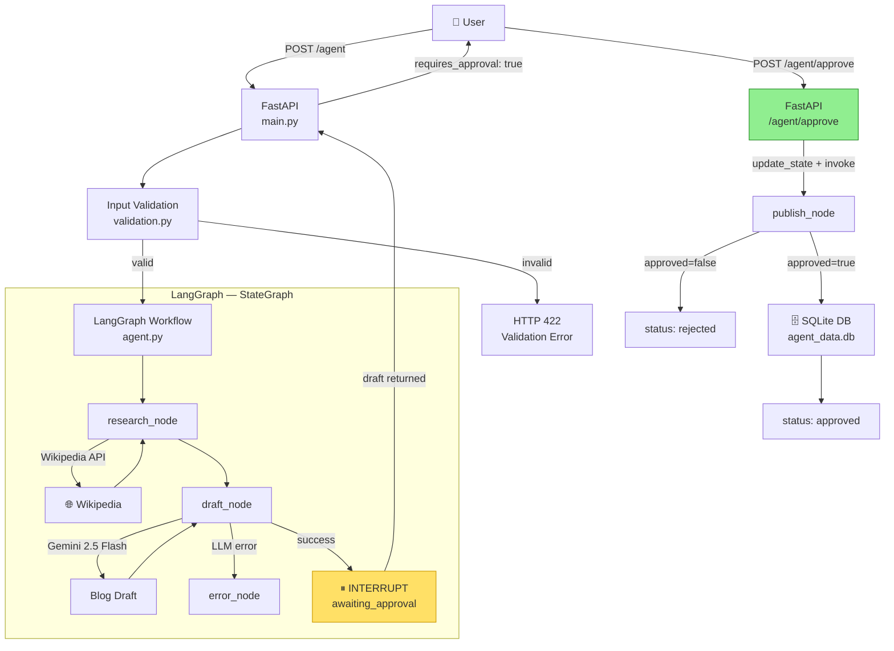

# Content Research & Blog Draft Agent
**Week 2 Day 5 Capstone — Production-Ready Agent System**

---

## Architecture



---

## Framework Justification

**LangGraph** was chosen over CrewAI or a raw loop for four reasons:

1. **Control-heavy, linear pipeline** — the workflow is always `research → draft → human gate → publish`; CrewAI's conversational agent routing adds overhead for a fixed sequence.
2. **Native HITL via `interrupt_before`** — LangGraph checkpoints state between the draft and publish steps with a single compile flag, enabling a clean two-call API design without polling or external queues.
3. **Deterministic branching** — the `after_draft` conditional edge handles the error path explicitly; a raw loop would require ad-hoc `if/else` chains with no state persistence.
4. **MemorySaver** persists graph state keyed by `thread_id`, allowing `POST /agent/approve` to resume exactly where `POST /agent` paused.

---

## Project Structure

```
capstone/
├── agent.py          # LangGraph workflow (research → draft → publish)
├── tools.py          # Wikipedia tool + SQLite helpers
├── validation.py     # Input validation (4 failure modes)
├── main.py           # FastAPI app (2 endpoints + health)
├── run_evals.py      # Evaluation runner (8 test cases)
├── requirements.txt
├── .env.example
└── README.md
```

---

## Quick Start

```bash
# 1. Clone and install
git clone <repo>
cd capstone
python -m venv .venv && source .venv/bin/activate
pip install -r requirements.txt

# 2. Configure
cp .env.example .env
# Edit .env and set GEMINI_API_KEY=...

# 3. Run the server
uvicorn main:app --reload --port 8000

# 4. Test (two-step workflow)

# Step 1 — Research + draft
curl -X POST http://localhost:8000/agent \
  -H "Content-Type: application/json" \
  -d '{"query": "History of the Internet", "thread_id": "demo-1"}'

# Step 2 — Approve (HITL checkpoint)
curl -X POST http://localhost:8000/agent/approve \
  -H "Content-Type: application/json" \
  -d '{"thread_id": "demo-1", "approved": true}'

# Or reject with a reason
curl -X POST http://localhost:8000/agent/approve \
  -H "Content-Type: application/json" \
  -d '{"thread_id": "demo-1", "approved": false, "rejection_reason": "Too short"}'

# 5. Run evaluations (server must be running)
python run_evals.py
```

---

## API Reference

### `POST /agent`
| Field | Type | Description |
|---|---|---|
| `query` | string | Research topic (3–1000 chars) |
| `thread_id` | string | Optional; auto-generated if omitted |

**Response**
```json
{
  "status": "awaiting_approval",
  "output": "## Title\n\nIntro...",
  "tokens_used": 2100,
  "latency_ms": 5230,
  "tools_called": ["wikipedia"],
  "thread_id": "abc-123",
  "requires_approval": true
}
```

### `POST /agent/approve`
| Field | Type | Description |
|---|---|---|
| `thread_id` | string | Must match the ID from `/agent` |
| `approved` | bool | `true` publishes; `false` rejects |
| `rejection_reason` | string | Optional reason (logged to DB) |

---

## Validation Rules
| Scenario | HTTP Code | Message |
|---|---|---|
| Empty query | 422 | "Query cannot be empty." |
| Query < 3 chars | 422 | "Query too short (N chars)." |
| Query > 1000 chars | 422 | "Query too long (N chars)." |
| Injection pattern | 422 | "Contains disallowed pattern: '…'" |
| Wikipedia timeout | — | Fallback to LLM knowledge, continues |
| LLM/model error | 500 | "Agent error: …" |

---

## Monitoring Checklist

### What to Track
| Metric | How | Notes |
|---|---|---|
| **Error rate** | Count 4xx/5xx per hour | Alert if > 5% of requests |
| **Latency P50/P95/P99** | Log `latency_ms` per request | P95 target < 12 s |
| **Token usage / cost** | Sum `tokens_used` daily | Alert if daily cost > $5 |
| **Output quality drift** | Weekly sample of 20 drafts | Manual spot-check tone + accuracy |
| **HITL rejection rate** | `rejected` events / total | Rising rate → prompt degradation |
| **Tool error rate** | `__TOOL_ERROR__` in logs | Wikipedia outages, API key issues |

### Alert Thresholds
| Condition | Action |
|---|---|
| Error rate > 5% over 15 min | PagerDuty alert → on-call |
| P95 latency > 12 s | Investigate Wikipedia timeouts; consider caching |
| Daily token cost > $5 | Audit query volume; add rate limiting |
| Wikipedia tool errors > 20% | Switch to DuckDuckGo search fallback |
| HITL rejection rate > 30% | Review system prompt quality |

### Re-evaluation Cadence
- **Weekly** — spot-check 20 randomly sampled outputs for factual accuracy and tone
- **Monthly** — full 8-case eval suite; compare against baseline table
- **On model upgrade** — re-run full suite before deploying new Gemini version

### Logging Events (SQLite `agent_logs` table)
```
research_start | research_done | draft_start | draft_done | draft_error
published | rejected | terminal_error | hitl_checkpoint
```
All events include `thread_id`, `details`, and `created_at` (UTC ISO-8601).
