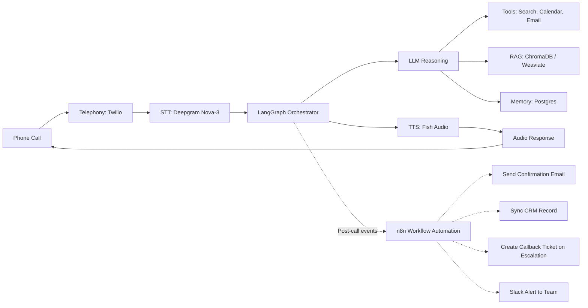

# Voice Agent Architecture — Research Document

**Project:** RealEstate Hub — AI Voice Agent (Pakistan market)
**Scope:** Day 1 foundations — architecture research and design decisions. No implementation yet.

---

## 1. Speech-to-Text (STT)

| Option | Streaming | Latency | Urdu Support | Notes |
|---|---|---|---|---|
| **Deepgram Nova-3** | Yes (native WebSocket) | ~200–300ms | Limited native Urdu; strong on Hindi/English code-switch, which is the closest proxy we have | Best latency-cost balance for phone-call use; has a code-switching model that handles Hinglish well, which transfers reasonably to UrduLish |
| **Whisper Large V3** | Batch-oriented (streaming needs chunking workarounds) | 1–3s in batch mode | Good Urdu accuracy (trained on large multilingual corpus) | Best raw Urdu accuracy but not built for live telephony without extra engineering (VAD + chunking) |
| **AssemblyAI** | Yes | ~300–400ms | Weaker Urdu coverage than Whisper | Strong English, good diarization and formatting, less proven for Urdu |

**Streaming vs. batch:** A phone-based voice agent needs streaming STT so the LLM can start reasoning while the caller is still speaking (or immediately after they stop), rather than waiting for a full recording to be transcribed. Batch transcription is acceptable only for offline QA/analytics on call recordings, not for the live turn.

**Latency implication:** Every stage in the pipeline (STT → LLM → TTS) adds to the caller's perceived "thinking time." For a natural phone conversation, total round-trip should stay under ~1.2–1.5s. STT should therefore consume no more than 300–400ms of that budget.

**Urdu support decision:** No STT vendor has excellent native Urdu accuracy at low latency today. Recommended approach: **Deepgram Nova-3** for latency, with a custom vocabulary/keyword-boost list (property names, areas like "DHA Phase 6", "Bahria Town", common Urdu real-estate terms) to compensate for weaker Urdu-specific accuracy, and periodic evaluation against **Whisper Large V3** transcripts for QA.

---

## 2. LLM Reasoning

| Option | Streaming | Tool-Calling | Cost | Notes |
|---|---|---|---|---|
| **GPT-5.5** | Yes | Mature, well-documented | Mid-high | Strong function-calling reliability, good multilingual reasoning |
| **Claude** | Yes | Mature, strong structured tool use | Mid-high | Strong at following persona/guardrail instructions consistently over long conversations, good refusal discipline for off-topic requests |
| **Gemini** | Yes | Mature | Lower cost tiers available (e.g., Flash-Lite) | Good for cheap drafting/support tasks; flash-tier models trade some reasoning depth for speed/cost |

**Decision guidance:**
- For the **live conversation brain** (the model actually talking to callers), prioritize instruction-following consistency and tool-calling reliability over raw benchmark scores, since a single hallucinated property detail or broken guardrail is costly in a sales context.
- A cheaper/faster model tier (e.g., Gemini Flash-Lite) is appropriate for **non-customer-facing drafting work** — generating summaries, drafting follow-up emails, or internal QA — not for the live call itself.
- Streaming matters mainly for text-based chat fallback; for voice, the LLM's output is consumed by TTS in chunks/sentences, so sentence-level streaming (not full-response streaming) is what actually reduces perceived latency.

---

## 3. Tool Calling

Tool calling lets the LLM request a structured action (e.g., "check_availability", "book_visit", "search_properties") instead of free-text, by emitting a JSON object matching a predefined schema.

- **How it works:** Each tool is defined with a name, description, and a JSON schema for its parameters. The LLM decides, based on the conversation state, when the user's request matches a tool's purpose (e.g., a date/time mentioned + intent to book → calls `book_visit`).
- **When the LLM decides to call a tool:** This is model-driven, not hardcoded — the system prompt's guardrails (Task 5) constrain *when* it's appropriate (e.g., "only call `book_visit` after name, phone, property, date, and time are all confirmed").
- **Error handling:** Every tool call must have a defined failure path. If a tool call fails (timeout, invalid data, backend error), the agent should not expose the raw error to the caller. It should retry once silently if appropriate, then fall back to an apology + human callback offer (see Task 5, Failure Handling), and log the failure for follow-up.

---

## 4. Retrieval (RAG)

| Option | Notes |
|---|---|
| **ChromaDB** | Lightweight, easy self-hosting, good for a single-tenant property catalog of moderate size |
| **Pinecone** | Managed, scales well, adds recurring cost — better once catalog size/query volume grows |
| **Weaviate** | Good hybrid (keyword + vector) search, useful since property search benefits from exact filters (price, bedrooms) combined with semantic search |
| **FAISS** | Fastest/cheapest for local, in-process search; less convenient for multi-instance production deployments |

**When to retrieve vs. answer directly:**
- Retrieve when the caller asks about specific inventory (available properties matching criteria, pricing, amenities, developer history) — this data changes and must never be hallucinated.
- Answer directly (no retrieval) for general conversation, persona-driven small talk, or generic real-estate education that doesn't depend on live inventory.

**Recommendation:** Start with **ChromaDB or Weaviate** — both support the hybrid filter (bedrooms=3, price<X) + semantic (find something "similar to X") pattern real estate search needs. Given structured filters matter more than pure semantic similarity here, a hybrid-search-capable store (Weaviate) is preferable if budget allows; ChromaDB with metadata filtering is a solid low-cost starting point.

---

## 5. Memory

- **Short-term (conversation buffer):** The current call's turn history, held in-process/in-session state, used so the agent doesn't ask the same question twice within one call.
- **Long-term (user profile + history):** Persisted across calls — past inquiries, preferences, previously booked/cancelled visits, so a returning caller gets the "Returning customer" flow (Task 2, Flow 5) instead of starting cold.

**Storage strategy:** Long-term memory belongs in a relational store (e.g., Postgres) keyed by phone number, since real estate CRM data (bookings, contact details, property interest) is inherently structured and needs to be queried by staff/CRM tools, not just by the agent. Short-term buffer can live in memory/cache (e.g., Redis) for the duration of the call and be discarded or summarized into long-term storage afterward.

---

## 6. Text-to-Speech (TTS)

| Option | Streaming | Voice Cloning | Emotion | Notes |
|---|---|---|---|---|
| **Fish Audio** | Yes | Yes | Moderate | Strong multilingual/code-switching support relevant to UrduLish; evaluated in detail in Task 4 |
| **ElevenLabs** | Yes | Yes, high quality | Strong | Very natural English, evaluated in detail in Task 4 |
| **OpenAI Realtime** | Yes (native realtime API) | No custom cloning | Moderate | Simplifies architecture since STT+LLM+TTS can be one realtime session, but reduces flexibility to swap in a Pakistani/UrduLish-tuned voice |

**Streaming:** Non-negotiable — the agent must speak the first words of its reply while the rest is still being synthesized, not wait for the full response.

Full comparison and recommendation: see `docs/fish_audio_evaluation.md`.

---

## 7. Telephony

| Option | Notes |
|---|---|
| **Twilio** | Most mature, best documentation, global reach, supports Pakistan numbers via SIP/voice APIs |
| **Plivo** | Often cheaper per-minute, similar feature set to Twilio |
| **Exotel** | Strong in South Asia specifically, may have better local rates/support for Pakistan-adjacent markets |

**How calls flow into the backend:** Inbound call → Telephony provider receives the call and opens a media stream (WebSocket) → audio is forwarded in real time to the STT service → transcribed text feeds the orchestrator → orchestrator's TTS output audio is streamed back through the same telephony WebSocket to the caller.

**Recommendation:** Twilio for Day-1 design purposes, given documentation maturity and ease of prototyping; Exotel worth a cost/quality comparison once volumes are known, since regional providers can be materially cheaper for South Asian call traffic.

---

## 8. Workflow Orchestration

| Option | When to use |
|---|---|
| **LangGraph** | When the conversation has real branching state (multiple flows, retries, escalation paths, tool calls with conditional logic) — fits this project well given 7 distinct conversation flows |
| **n8n** | Good for the *backend automation* around the agent (e.g., sending confirmation emails, CRM updates, Slack alerts on escalation) rather than the live conversation logic itself |
| **Custom (hand-rolled state machine)** | Only justified if LangGraph's abstractions become limiting at scale; not recommended for Day 1 |

**Recommendation:** **LangGraph** for the live conversation orchestration (it naturally maps to the flowcharts in Task 2 — each flow is a graph), and **n8n** for the surrounding automations (confirmation emails, CRM sync, callback ticket creation) rather than building those into the conversation graph itself.

---
## Architecture Diagram

**Flow summary:** A call arrives via Twilio, is transcribed live by Deepgram, and handed to a LangGraph orchestrator that manages conversation state. The orchestrator invokes the LLM, which may call tools (property search, calendar, email), query the RAG store for live inventory data, and read/write long-term memory in Postgres. The LLM's reply is streamed to Fish Audio for synthesis and returned to the caller through the same Twilio call leg. **In parallel, the orchestrator emits post-call events to n8n** — which handles confirmation emails, CRM sync, escalation callback tickets, and internal Slack alerts — keeping these slow, non-realtime operations out of the live conversation path.
