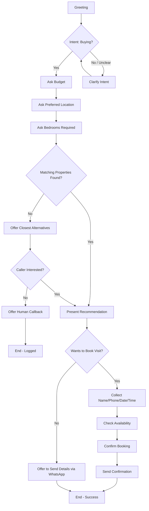
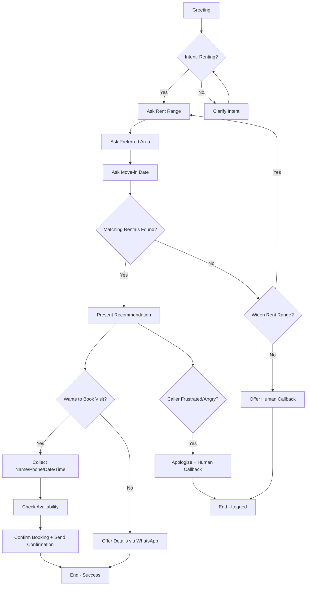
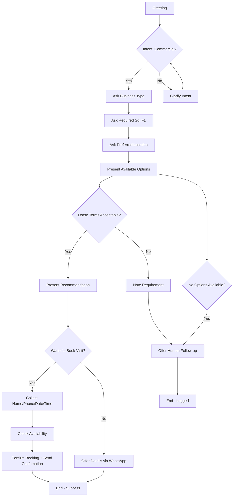
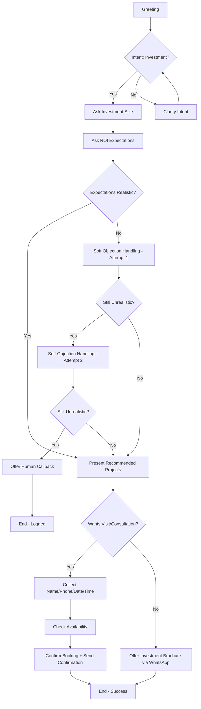
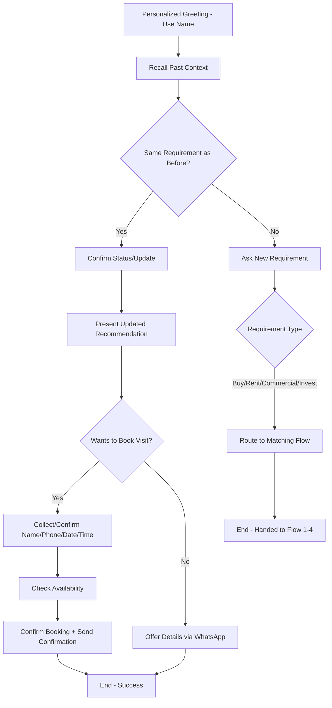
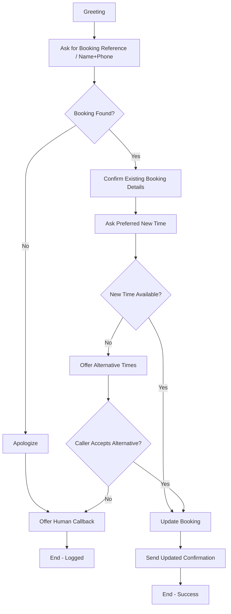
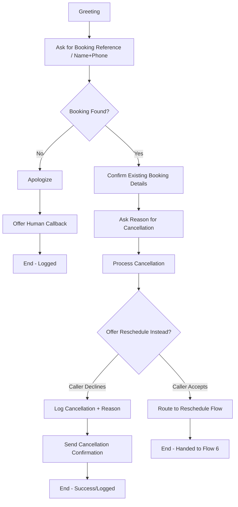

> **Global fallback (applies to all flows):** If the caller hangs up at any point, the orchestrator logs the partial conversation state (name, phone if captured, intent, last question asked) so the team can follow up. This is handled at the telephony/orchestrator layer and is not repeated in each flowchart below.

# Conversation Flow Design

**Project:** RealEstate Hub — AI Voice Agent
Each flow below lists entry condition, decision points, success exit, and failure/fallback exit, followed by a Mermaid flowchart.

---

## 1. Buyer Inquiry

- **Entry condition:** Inbound call, no existing profile match, caller intent = buying a property.
- **Decision points:** Intent confirmed? Budget stated? Location stated? Bedroom count stated? Matching inventory found?
- **Success exit:** Recommendation given → visit booked → confirmation sent.
- **Failure/fallback exit:** No matching inventory → offer closest alternatives or human callback. Caller hangs up at any point → log partial data for follow-up.

---

## 2. Rental Inquiry

- **Entry condition:** Inbound call, intent = renting.
- **Decision points:** Rent range stated? Area stated? Move-in date stated? Match found?
- **Success exit:** Recommendation → visit booked.
- **Failure/fallback exit:** No match within rent range → widen range or offer callback; caller becomes frustrated → escalate.

---

## 3. Commercial Property Inquiry

- **Entry condition:** Inbound call, intent = commercial space.
- **Decision points:** Business type stated? Square footage needed? Location? Lease terms acceptable?
- **Success exit:** Recommendation → visit booked.
- **Failure/fallback exit:** No suitable commercial listing → callback; lease terms mismatch → note requirement and offer follow-up.

---

## 4. Investment Inquiry

- **Entry condition:** Inbound call, intent = investment.
- **Decision points:** Investment size stated? ROI expectations stated? Suitable project found?
- **Success exit:** Recommended projects → visit/consultation booked.
- **Failure/fallback exit:** ROI expectations unrealistic → soft objection handling (max 2 attempts) then human callback.

---

## 5. Returning Customer

- **Entry condition:** Caller's phone number matches an existing profile.
- **Decision points:** Past context relevant to current call? New requirement stated?
- **Success exit:** Personalized recommendation based on history → booking or follow-up.
- **Failure/fallback exit:** Caller's needs have changed entirely → treat as new inquiry (route into Flow 1–4).

---

## 6. Appointment Rescheduling

- **Entry condition:** Caller wants to change an existing booking.
- **Decision points:** Existing booking identified? New time available?
- **Success exit:** Booking updated → confirmation sent.
- **Failure/fallback exit:** Booking not found → escalate; no availability at new time → offer alternatives.

---

## 7. Appointment Cancellation

- **Entry condition:** Caller wants to cancel an existing booking.
- **Decision points:** Booking identified? Reason captured? Reschedule offered?
- **Success exit:** Cancellation logged; reschedule offered as soft save.
- **Failure/fallback exit:** Booking not found → escalate.

