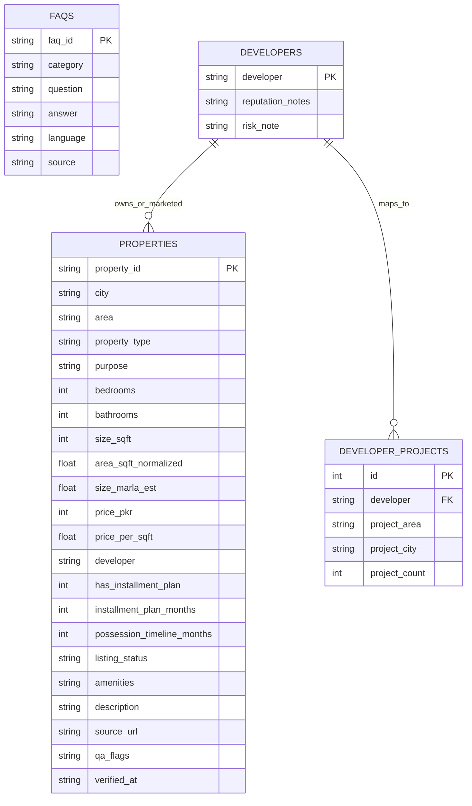

# Knowledge Base Design — Day 2

## Dataset Contracts

| Dataset | Storage | Primary Key | Purpose |
|---|---|---|---|
| properties | SQLite + JSON export | `property_id` | Structured truth for price, size, availability, developer |
| faqs | SQLite + JSONL | `faq_id` | Semantic answers for policies/process questions |
| developers | SQLite + JSON | `developer` | Reputation notes + project context |
| developer_projects | SQLite | `id` | Project-level mapping for each developer |
| nearby_schools (planned) | SQLite | `id` | Area-level schooling context |
| nearby_hospitals (planned) | SQLite | `id` | Area-level healthcare access context |
| payment_plans (planned) | SQLite | `id` | Installment schedule and milestone details |

## Entity Fields (Day 2 delivered)
- **properties:** identity, geo text, property_type, purpose, beds/baths, size, price, installment flags, derived affordability metrics, amenities, description, source provenance.
- **faqs:** question-answer pairs in UrduLish with category and source tags.
- **developers:** normalized developer profile with reputation and risk notes.
- **developer_projects:** frequent projects/areas linked back to developer.

## ERD

## Retrieval Ownership
- **SQLite (hard facts):** prices, purpose, bedrooms, availability, installment flags, top developer/project links.
- **Chroma (semantic):** descriptions, FAQ answers, developer narrative context.

## Decisions & Tradeoffs
- Adopted hybrid data architecture (SQL + vector) to enforce no-hallucination on hard facts while retaining natural Q&A support.
- Stored FAQ and developer artifacts in both durable JSON and SQLite for reproducibility and queryability.
- Deferred schools/hospitals tables to next ingestion cycle, but reserved schema slots to avoid breaking changes.

## Risks & Mitigations
- **Risk:** Developer reputation text can become stale.  
  **Mitigation:** include `generated_at` metadata and monthly refresh policy.
- **Risk:** Mixed Roman Urdu spellings reduce semantic recall.  
  **Mitigation:** use alias normalization before embedding and query expansion at retriever layer.
- **Risk:** Future rental ingestion may conflict with sale-only assumptions.  
  **Mitigation:** keep `purpose` explicit and route by purpose in SQL filters.
