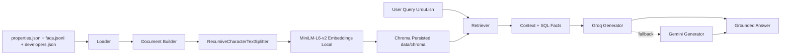

# RAG Pipeline — Day 2

## Pipeline Flow
1. Load structured and semantic assets (`properties.json`, `faqs.jsonl`, `developers.json`).
2. Convert semantic text records into `Document` objects with metadata.
3. Chunk using `RecursiveCharacterTextSplitter`.
4. Embed locally with `sentence-transformers/all-MiniLM-L6-v2`.
5. Persist vectors in Chroma at `data/chroma/`.
6. Retrieve top-k relevant context with metadata filters.
7. Generate grounded response with Groq (`openai/gpt-oss-120b`) and Gemini fallback.

## Mermaid Architecture

## Grounding Policy
- Retrieval miss returns: transparent fallback + human callback offer.
- Generator receives explicit instruction: never fabricate property attributes.
- SQL facts injected ahead of vector text when conflict exists.

## Decisions & Tradeoffs
- Chroma selected for local persistence and zero extra API key usage.
- MiniLM selected despite English-centric bias to meet local/offline embedding requirement; mitigated via Roman Urdu normalization and measured experiments.
- Gemini kept as fallback only to preserve Groq-first behavior and predictable latency profile.

## Risks & Mitigations
- **Risk:** Roman Urdu spelling variation can lower recall.  
  **Mitigation:** query normalization + keyterm dictionary from city/area/developer names.
- **Risk:** Groq rate limits can spike latency.  
  **Mitigation:** tenacity exponential backoff with jitter and fallback failover.
- **Risk:** Long chunks inflate response time.  
  **Mitigation:** selected chunk size after latency/quality benchmark.
