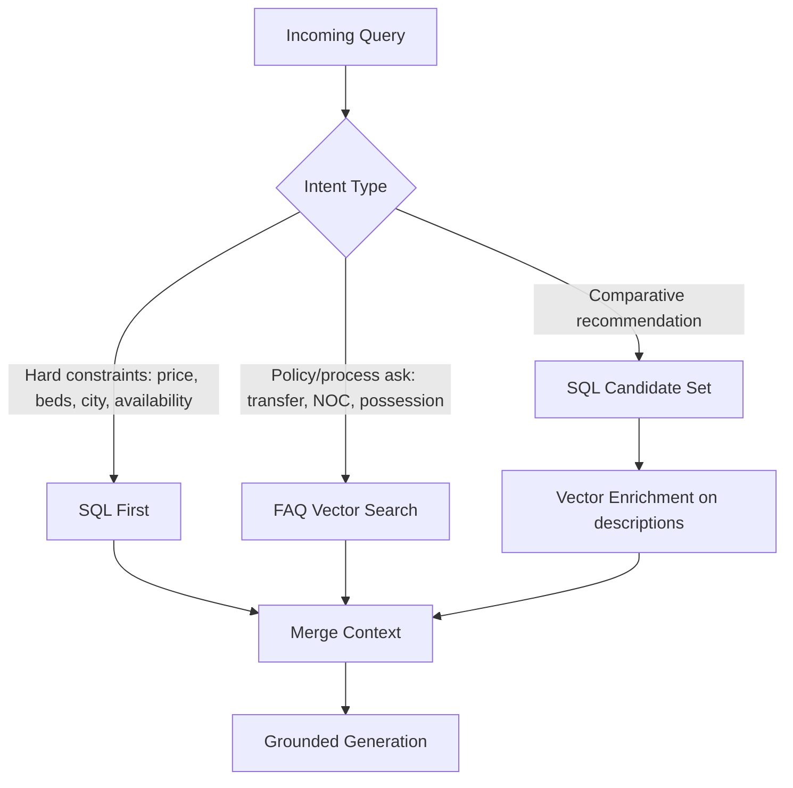

# Structured Retrieval Design — SQLite First

## SQLite-Compatible DDL
```sql
PRAGMA journal_mode=WAL;
PRAGMA foreign_keys=ON;

CREATE TABLE properties (
  property_id TEXT PRIMARY KEY,
  city TEXT NOT NULL,
  area TEXT NOT NULL,
  property_type TEXT NOT NULL,
  purpose TEXT NOT NULL,
  bedrooms INTEGER,
  bathrooms INTEGER,
  size_sqft INTEGER NOT NULL,
  area_sqft_normalized REAL NOT NULL,
  size_marla_est REAL,
  price_pkr INTEGER NOT NULL,
  price_formatted TEXT NOT NULL,
  price_per_sqft REAL,
  developer TEXT NOT NULL,
  has_installment_plan INTEGER NOT NULL,
  installment_plan_months INTEGER NOT NULL,
  possession_timeline_months INTEGER NOT NULL,
  listing_status TEXT NOT NULL,
  amenities TEXT,
  description TEXT NOT NULL,
  source_url TEXT NOT NULL,
  qa_flags TEXT,
  verified_at TEXT NOT NULL
);
```

## Example Queries
```sql
-- Budget + city + bedrooms
SELECT property_id, area, bedrooms, price_pkr, has_installment_plan
FROM properties
WHERE city = 'Lahore'
  AND purpose = 'Sale'
  AND price_pkr <= 30000000
  AND bedrooms >= 3
  AND listing_status = 'available'
ORDER BY price_pkr ASC
LIMIT 5;

-- Installment-friendly options
SELECT property_id, area, price_pkr, installment_plan_months
FROM properties
WHERE city = 'Karachi'
  AND has_installment_plan = 1
ORDER BY installment_plan_months ASC, price_pkr ASC
LIMIT 10;
```

## SQL-vs-Vector Routing Logic


Routing rules:
1. If query includes numeric filters or explicit availability checks → SQL is mandatory.
2. If query is explanatory (`NOC`, `transfer`, `maintenance`) → vector FAQ retrieval.
3. If mixed intent → SQL first for candidate truth, then vector for narrative details.
4. If SQL returns no rows → explicit no-match response + human callback option.

## Decisions & Tradeoffs
- Prioritized SQL for any field that can be objectively validated to enforce zero hallucination tolerance.
- Allowed vector retrieval only for descriptive and procedural context.
- Chose deterministic routing keywords for Day 2 simplicity over full classifier to reduce latency variance.

## Risks & Mitigations
- **Risk:** Keyword routing may misclassify ambiguous queries.  
  **Mitigation:** fallback to mixed mode (SQL + vector) when confidence is low.
- **Risk:** SQL-only constraints can feel rigid conversationally.  
  **Mitigation:** convert SQL misses into soft alternatives and callback flows.
- **Risk:** stale listing status can mislead booking pipeline.  
  **Mitigation:** enforce pre-booking availability re-check before any confirmation.
